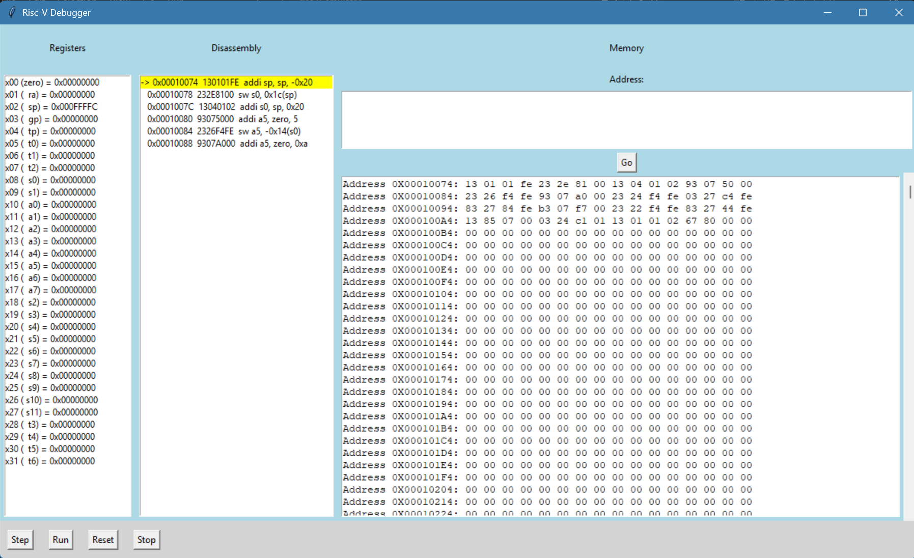

# RISC-V Emulator & Visual Debugger
This project implements a fully functional RISC-V (RV32I) CPU emulator and visual debugger in Python. Given a compiled RISC-V ELF binary, the emulator loads it into a simulated memory space and executes it instruction by instruction, while the debugger provides a live view of register state, disassembly, and memory. The project was built to explore computer architecture concepts such as instruction encoding, the fetch/decode/execute cycle, memory models, and low-level debugging tooling.

## Features
- Full RV32I base integer instruction set (47 instructions across 6 encoding formats)
- ELF binary loader supporting real compiled RISC-V programs
- Step, run, reset, and halt execution controls
- Live register viewer showing all 32 registers with ABI names and hex values
- Disassembly panel with current instruction highlighted in real time
- Hex memory inspector with address navigation

## Technologies/Logic Used
- Python 3.10+
- pyelftools
- Capstone
- Tkinter
- Bitwise operations and instruction encoding
- Fetch/decode/execute pipeline
- Little-endian memory model
- ELF binary format

## How It Works
The emulator works by reading a compiled RISC-V ELF binary, parsing its loadable segments with pyelftools, and copying them into a byte-addressable memory model at their specified virtual addresses. The CPU then enters a fetch/decode/execute loop: each cycle reads a 32-bit instruction word from memory at the program counter, extracts fields like opcode, register indices, and immediates using bitwise operations, and dispatches to the appropriate handler. All 47 RV32I instructions are implemented across 10 handler methods. The visual debugger built with Tkinter wraps the CPU and calls `step()` on each button press, refreshing the register viewer, Capstone-powered disassembly panel, and hex memory dump after every execution step.

## Results & Findings

Building this emulator gave me a much deeper understanding of how CPUs actually work at the hardware level. Implementing sign extension from scratch across 5 different immediate formats made it clear why instruction encoding decisions in ISA design have real consequences for hardware complexity. Debugging the stack pointer initialization issue — where `sp` started at 0 and stores immediately wrapped to `0xFFFFFFFC` — gave me direct hands-on experience with calling conventions and memory layout that reading about them never would have. Seeing `a0 = 0xF` in the register viewer after the first successful run of a compiled C program was a genuinely satisfying moment.

## Challenges
I started this project with no prior experience in emulator development or low-level architecture. The steepest part of the learning curve was understanding RISC-V instruction encoding, specifically that immediates are scrambled across non-contiguous bit positions depending on the format, and that getting sign extension wrong causes silent incorrect behavior rather than a clear error. The B-type and J-type immediate formats in particular required careful study of the spec before the bit reassembly made sense.

Another significant challenge was the transition from a conceptual understanding of the fetch/decode/execute cycle to an actual working implementation. Early bugs like calling memory methods on the class instead of the instance, passing register indices instead of register values to handlers, and updating the PC before saving the return address in JAL all required careful debugging to find. Each one reinforced how precise low-level programming needs to be.

## Future Improvements
Some ideas I want to add to the emulator in the future include:
- RV32M extension for multiply and divide instructions
- ECALL handling for basic system calls so programs can print output
- A minimal C runtime startup stub to remove the PC=0 halt workaround
- Breakpoint support — click an instruction in the disassembly to pause execution there
- Background threading for the Run button so the GUI stays responsive during execution
- RV32C compressed 16-bit instruction support
- Configurable memory size and base address

## License
Distributed under the MIT License. See `LICENSE` for more information.
